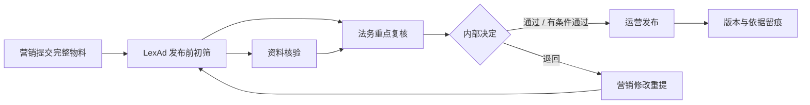
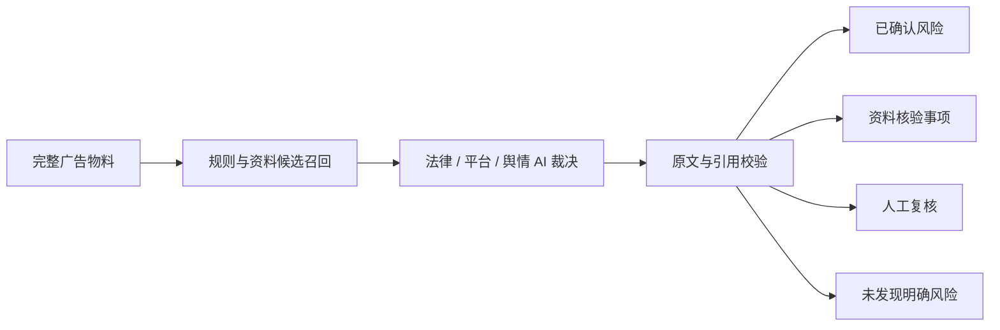

# LexAd v0.7.0

**资料库约束下的企业广告合规与舆情协同审查平台**

LexAd 面向企业广告发布前审查，让法规、行业资料、平台规则和舆情案例成为 AI 判断的可信边界，并把结果转化为营销、法务、合规和平台运营可以共同处理的结构化任务。

> 规则负责召回候选，AI 负责结合语境裁决，系统负责验证证据与依据，专业人员负责最终决定。

## 为什么需要 LexAd

企业广告审查并不是简单地搜索违禁词：

- 法律、行业规范和平台政策分散，版本与有效期不同；
- 人工逐条检索、比对和整理依据耗时；
- 关键词工具容易把数字、短词和脱离语境的片段直接判为风险；
- 同一物料需要在多个平台重复审查；
- 风险判断、证明材料、修改意见和最终决定缺少统一记录。

LexAd 将这些工作连接为一条发布前协作链，让法务从大范围机械筛查转向重点处理已确认风险、资料核验和异常复核。

## 核心创新

### 1. AI 语境裁决优先

硬规则和关键词只用于内部候选召回，不直接生成违规结论、不直接扣分，也不作为用户可见理由。AI 必须阅读完整文案，并判断候选是否真正适用。

### 2. 资料库优先与引用约束

模型优先使用系统提供的法规、行业规则、平台规则和已核验案例。结论引用只能指向本轮输入中真实存在的资料标识，避免凭模型记忆编造法规或规则。

### 3. 原文证据与资料依据双重验证

已确认风险必须同时具有可在物料中逐字定位的完整原文，以及有效的资料库依据。数字切片、单字、分词和内部相似度不会进入面向用户的结论。

### 4. 风险与事实核验分离

销量、来源、检测、认证和资质等声明不被机械判为违法，而是进入独立核验清单，说明需要补充什么材料、为什么需要核验。

### 5. 不确定性可见

AI 不可用、资料不足、平台没有生效规则或引用验证失败时，系统明确转人工复核，不把候选回退成确定性违规，也不伪装成自动通过。

## 企业应用价值



- **营销**：更早获得修改方向和证明材料清单；
- **法务与合规**：减少无效规则排查，直接查看原文、理由和依据；
- **平台运营**：一次任务关联多个平台的当前生效规则；
- **管理人员**：集中维护资料版本，统一组织审查尺度；
- **审计复盘**：保留提交快照、规则版本、AI 结果和法务决定。

效率提升来自候选过滤、资料检索缩短、任务分流、多平台协同和版本留痕。项目不使用未经实测的效率百分比或准确率宣传。

## 审查机制



法律合规、平台规则与舆情分别判断：

- 法律合规分越高，表示当前发现的明确法律与平台风险越少；
- 舆情风险分越高，表示社会观感与传播风险越高；
- 舆情结果不计入法律合规分；
- “未发现明确风险”不等于监管意义上的合规保证。

完整方法见 [审查方法论](docs/architecture/review-methodology.md)。

## 产品能力

- 提交广告文案或 JPG、PNG、GIF、BMP、PDF、DOCX、PPTX、XLSX、TXT 文件；
- 按行业和投放平台执行法律、平台与舆情双轴审查；
- 展示已确认风险、资料核验事项、人工复核原因和修改建议；
- 支持法务通过、有条件通过、退回和修改重提；
- 保存提交快照、审查版本、平台规则版本和舆情资料库版本；
- 管理品牌档案、舆情案例、平台规则、导入记录和操作日志；
- 管理员加密保存与轮换 DeepSeek API Key；
- 支持 15 天回收站、恢复和审计式永久清理；
- 提供亮色、深色、跟随系统主题和响应式布局。

## 快速开始

### 环境要求

- Python 3.10+
- Node.js 18+
- npm
- 可选：Tesseract OCR
- 完整 AI 审查需要可用的 DeepSeek API Key

### Windows

首次安装：

```powershell
cd backend
python -m venv venv
venv\Scripts\activate
pip install -r requirements.txt
alembic upgrade head

cd ..\frontend
npm install
```

日常运行：

```text
start-dev.bat
```

停止：

```text
stop-dev.bat
```

### macOS / Linux

后端：

```bash
cd backend
python3 -m venv venv
source venv/bin/activate
pip install -r requirements.txt
alembic upgrade head
uvicorn app.main:app --host 0.0.0.0 --port 8000 --reload
```

前端：

```bash
cd frontend
npm install
npm run dev -- --host 0.0.0.0 --port 5173
```

访问：

- Web 界面：<http://localhost:5173>
- OpenAPI 文档：<http://localhost:8000/docs>

详细配置、数据库模式和排错见 [本地开发指南](docs/guides/local-development.md)。

## 本地演示账号

| 角色 | 用户名 | 本地演示密码 |
| --- | --- | --- |
| 管理员 | `admin` | `admin123` |
| 市场部 | `market01`–`market10` | `test1234` |
| 法务部 | `legal01`–`legal10` | `test1234` |

这些账号仅用于本地开发与产品演示。公开部署必须替换默认凭据。

## 技术栈

- 前端：Vue 3、TypeScript、Vite、Pinia、Vue Router、Axios、UnoCSS
- 后端：FastAPI、Python 3.10+、SQLAlchemy 2、Alembic、Pydantic v2
- 数据库：SQLite、PostgreSQL / Neon
- AI：DeepSeek OpenAI-compatible API
- 检索与解析：pyahocorasick、ChromaDB、PyMuPDF、python-docx、python-pptx、openpyxl、Pillow、Tesseract

## 质量状态

v0.7.0 当前验证：

- 后端完整回归：116 项测试通过；
- 前端：TypeScript 检查与生产构建通过；
- 核心覆盖：候选不直接定性、引用验证、核验分流、平台降级、舆情人工复核、权限与版本追溯。

复现命令：

```bash
cd backend
python -m pytest app/tests -q
```

```bash
cd frontend
npm run build
```

## 文档入口

| 读者 | 推荐入口 |
| --- | --- |
| 项目评估人员 | [项目概览](docs/project/project-overview.md) · [演示与评测指南](docs/project/demo-evaluation-guide.md) |
| 企业用户 | [用户指南](docs/guides/user-guide.md) · [审查方法论](docs/architecture/review-methodology.md) |
| 管理员 | [管理员指南](docs/guides/admin-guide.md) |
| 开发者 | [本地开发指南](docs/guides/local-development.md) · [技术参考](docs/architecture/technical-reference.md) |
| 版本评估 | [v0.7.0 发布说明](docs/releases/v0.7.0-release-notes.md) · [历史归档](docs/archive/) |

完整导航见 [文档中心](docs/README.md)。

## 版本更新记录

| 版本 | 日期 | 主要变化 |
| --- | --- | --- |
| v0.7.0 | 2026-07-15 | 资料库约束下的 AI 语境裁决、引用验证、资料核验分流与人工复核降级 |
| v0.6.3 | 2026-07-14 | 业务模型请求可靠性、舆情案例同步与当时版本的证据融合机制 |
| v0.6.2 | 2026-07-14 | 管理员 AI 配置、密钥加密、15 天回收站与登录稳定性 |
| v0.6.1 | 2026-07-13 | 导航重构、知识基线、平台接入与历史版本展示 |
| v0.6.0 | 2026-07-12 | 响应式界面、品牌库、深色主题、数据库模式与启动可靠性 |
| v0.5.1 | 2026-07-08 | 明暗主题、提交快照、有条件通过与前端结构打磨 |
| v0.5.0 | 2026-07-08 | 退回闭环、舆情资料接入、平台别名与结果规范化 |
| v0.4.2 | 2026-07-07 | 管理员资料中心、平台规则版本、双轴结果与批量导入 |
| v0.4.1 | 2026-07-05 | 后台异步审查、知识库浏览、权限和安全增强 |
| v0.4.0 | 2026-05-17 | 多格式文件提取、批量验证与界面统一 |
| v0.3.0 | 2026-05-15 | 市场与法务审核闭环、分层审查引擎与知识库基础 |

详细路线见 [主要版本演进](docs/archive/major-version-evolution.md)，逐版本记录见 [历史发布说明](docs/archive/README.md)。

## 责任边界

LexAd 是广告合规与舆情风险辅助工具，不替代律师意见、企业最终决定或监管机关认定。资料具有时效性，模型可能遗漏或误判；重大投放、敏感行业、争议事项和事实真实性仍需专业人员复核。
