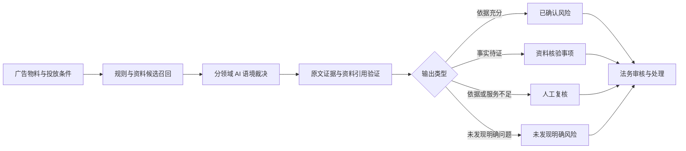
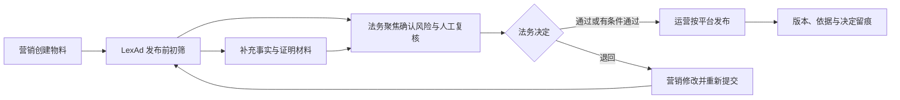

# LexAd v0.7.0 审查方法论

本文说明 LexAd 如何把规则检索、AI 语境判断、资料依据验证和人工复核组合为一条可解释的广告审查链。它是当前审查行为的唯一事实说明；其他文档仅作摘要并链接到本文。

## 1. 方法定位

LexAd 的目标不是用关键词代替法律判断，而是帮助企业在广告发布前完成结构化初筛：

- 规则、法规、平台规范和案例先提供候选资料；
- AI 阅读完整文案，在资料库约束下判断候选是否真正适用；
- 系统验证原文证据和引用标识，过滤不可追溯输出；
- 无法仅凭文案确认的事实进入资料核验事项；
- 资料不足、引用失败或模型不可用时转人工复核。

系统输出属于合规辅助意见，不替代律师意见、企业责任人员决定或监管机关认定。

## 2. 总体流程

这条链路包含三条相互独立的判断分域：法律合规、平台规则和舆情风险。法律合规分数不混入舆情分数，避免不同风险概念相互稀释。

## 3. 候选召回不是违规结论

### 3.1 硬规则候选

本地规则引擎使用 AC 自动机快速扫描文案。扫描结果只进入 AI 的候选输入，并记录候选数量；不会直接进入用户可见的违规清单，也不会直接扣减合规分数。

因此，孤立数字、单字、短词或规则片段即使被召回，也必须经过完整语境判断。系统不得向用户展示内部拆分出的数字切片、分词、匹配分或原始关键词列表。

### 3.2 法规与行业资料

法律语义裁决优先加载项目资料库中的现行法规和所选行业规则，并为每项资源分配可验证标识。相似案例可以辅助理解，但不能替代法规与规则依据。

### 3.3 平台规则

平台审查只使用数据库中与所选平台匹配、处于启用状态且在有效期内的规则版本。没有规则集、没有生效版本或没有结构化规则时，该平台进入人工复核，不被默认为通过。

### 3.4 舆情候选

触发词和历史事件只用于召回可能相关的舆情候选。它们不会在本地直接生成中高风险，也不会作为用户可见理由。AI 必须独立阅读完整文案，并判断历史事件的风险机制是否真正相似。

## 4. 分领域 AI 裁决

### 4.1 法律合规裁决

法律裁决接收完整文案、行业、法规与行业资料、硬规则候选及少量相似案例。模型必须输出结构化结果：

- `findings`：有完整原文证据和资料库依据的已确认问题；
- `verification_items`：需要核验销量、来源、认证、资质、统计口径或证明材料的声明；
- `excluded_candidate_ids`：被语境排除的内部候选；
- `overall_assessment`：整体评估。

模型可以发现候选未覆盖、但资料库能够支持的问题。反过来，候选命中本身没有结论效力。

### 4.2 平台规则裁决

每个所选平台独立调用裁决，输入该平台当前生效版本的结构化规则。只有规则确实适用于当前业务场景，且文案存在语义完整的冲突表达时，才能形成已确认平台风险。

### 4.3 舆情语义裁决

舆情审查面向价值观偏差、苦难营销、焦虑营销、群体冒犯、歧视、低俗擦边、灾难营销、社会伦理和情绪操纵等开放风险。法律上未发现问题不等于舆情低风险。

AI 可以使用已核验历史事件辅助判断，但只能引用输入候选中真实存在的事件标识。最终展示的相似事件由 AI 选择，系统不会把本地相似度命中直接暴露为理由。

## 5. 输出验证

### 5.1 原文证据验证

法律、平台和舆情结论中的原文证据必须：

1. 能在提交文案中逐字找到；
2. 具有最低语义完整性，而不是数字、单字或无意义切片；
3. 与风险类型和理由保持一致。

不满足条件的模型输出被丢弃，并触发人工复核标记或内部审计提示。

### 5.2 资料依据验证

法律风险必须至少引用一个本轮输入中真实存在的法规或行业资料标识；平台风险必须引用当前平台候选规则中的真实标识。系统只向用户展示通过校验的资料标题和版本。

AI 的解释不是独立法律依据。无法建立有效资料引用时，不得编造法规、条款或平台规则。

### 5.3 结果去重

系统以规范化后的原文证据和风险类型去重，防止同一问题因多个候选规则重复展示。候选数量可用于内部审计，但不会等价为风险数量。

## 6. 三类用户输出

### 6.1 已确认风险

每项风险包含：

- 语义完整的原文证据；
- 中文风险等级；
- 结合上下文的判断理由；
- 资料库中的依据标题与版本；
- 可执行的修改建议。

只有通过原文与引用验证的法律或平台问题才参与法律合规计分。

### 6.2 资料核验事项

销量、数据来源、检测结论、认证、资质和证明材料等声明可能并不当然违法，但其真实性通常不能仅凭文案确认。系统将其单独输出为核验事项，并说明核验原因和建议补充的材料。

核验事项与违规结论分离，避免把“需要证明”误写为“已经违法”。

### 6.3 人工复核

出现以下任一情形时，系统明确提示人工复核：

- AI 裁决服务不可用或返回内容无法解析；
- 法规、行业资料或平台规则版本缺失；
- 模型证据不在原文中或语义不完整；
- 引用的资料标识不存在；
- 舆情有效证据或置信度不足。

人工复核不是系统故障的掩盖，而是安全降级路径。系统不会在依据不足时伪装成“自动通过”。

## 7. 状态与计分

### 7.1 法律审查状态

| 状态 | 含义 |
| --- | --- |
| `no_clear_risk` | 未发现经验证的明确风险，也没有待核验事项 |
| `needs_verification` | 未发现明确违规，但存在资料核验事项 |
| `confirmed_risk` | 存在经 AI 与引用验证确认的风险 |
| `manual_review` | 某个审查分域的依据或服务不足，需要人工复核 |

### 7.2 法律合规分

法律合规分从 100 分开始，只按已确认法律或平台风险扣减：高风险 30 分、中风险 15 分、低风险 5 分，最低为 0 分。分数越高表示当前自动审查发现的明确风险越少，不代表监管意义上的合规保证。

### 7.3 舆情分

舆情风险采用独立的风险等级与 0–100 风险分，分数越高表示舆情风险越高。它不参与法律合规分计算。

## 8. 资料库优先原则

“资料库优先”具体意味着：

- 模型先使用系统提供的法规、行业规则、平台规则和已核验事件；
- 结论引用只能指向本轮输入中存在的资料标识；
- 资料缺失时明确提示维护或人工复核；
- 模型不得凭记忆虚构法规名称、条款、平台规则或历史事件；
- 管理员负责维护资料来源、版本、有效期、发布状态和审计记录。

资料库优先并不表示机械照搬资料。AI 仍需判断规则适用条件、完整语境和证据强度。

## 9. 企业流程中的作用

LexAd 将大范围人工初筛转化为“已确认风险、资料核验、人工复核”三类任务，帮助法务集中处理更需要专业判断的部分；同时让营销和运营更早看到修改方向、平台差异和所需材料。

## 10. 已知边界

- 法规与平台规则具有时效性，资料库未及时更新会影响结果。
- 模型可能产生遗漏或误判，引用校验降低风险但不能消除全部错误。
- 文案之外的产品事实、实验数据、授权关系和实际投放方式需要外部材料验证。
- 不同地区、行业和平台的特殊要求可能超出当前资料覆盖范围。
- 高风险业务、重大投放或争议事项仍应由专业人员复核。
