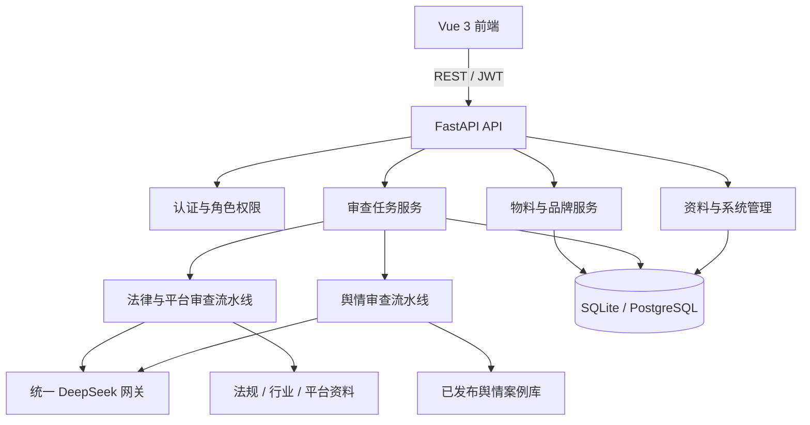

# LexAd v0.7.1 技术参考

本文记录 v0.7.1 当前实现、接口与运行约束。审查判断原则见 [审查方法论](review-methodology.md)，本地安装与排错见 [本地开发指南](../guides/local-development.md)。

## 1. 系统架构



前端负责角色化工作台、物料提交、结构化结果展示、法务决定和管理界面。后端负责权限、数据持久化、文件解析、资料检索、AI 调用、证据校验和审查状态流转。

## 2. 技术栈

| 层级 | 当前技术 |
| --- | --- |
| 前端 | Vue 3、TypeScript、Vite、Pinia、Vue Router、Axios、UnoCSS |
| 后端 | Python 3.10+、FastAPI、SQLAlchemy 2、Alembic、Pydantic v2 |
| 数据库 | SQLite；生产模式支持 PostgreSQL / Neon |
| AI | DeepSeek OpenAI-compatible API，固定模型 `deepseek-v4-flash` |
| 本地规则 | pyahocorasick |
| 相似检索 | ChromaDB |
| 文档解析 | PyMuPDF、python-docx、python-pptx、openpyxl、Pillow、Tesseract |
| 部署 | Docker Compose、Render、Nginx 静态前端镜像 |

## 3. 目录职责

```text
LexAd/
├─ backend/
│  ├─ app/api/                 REST 接口、依赖与角色权限
│  ├─ app/core/                配置、安全、日志
│  ├─ app/db/                  会话、初始化与演示数据
│  ├─ app/engine/              规则召回、AI 裁决、引用校验
│  ├─ app/models/              SQLAlchemy 数据模型
│  ├─ app/schemas/             Pydantic 输入输出契约
│  ├─ app/services/            业务服务、模型网关、资料管理
│  ├─ app/tests/               后端回归测试
│  └─ alembic/versions/        数据库迁移
├─ frontend/src/
│  ├─ api/                     Axios 请求封装
│  ├─ components/              布局、品牌与审查组件
│  ├─ pages/                   业务页面
│  ├─ router/                  路由和角色守卫
│  ├─ stores/                  Pinia 状态
│  └─ types/                   TypeScript 类型
├─ data/                       结构化规则、触发词和案例源数据
├─ knowledge/                  L1–L5 本地知识资料
├─ chroma_data/                ChromaDB 持久化目录
├─ scripts/                    本地启动与维护脚本
└─ docs/                       当前文档、发布记录和历史归档
```

## 4. 角色与权限

| 角色 | 主要能力 |
| --- | --- |
| 市场部 `marketing` | 创建品牌和物料、提交 AI 审查、查看本人任务、修改退回物料 |
| 法务部 `legal` | 查看待审队列和可见物料、提交通过、退回或有条件通过决定 |
| 管理员 `admin` | 具有业务操作能力，并管理资料库、平台规则、AI 配置和回收站 |

后端权限依赖是最终边界，前端路由守卫只负责界面导航。物料查询还会执行可见性校验，市场人员不能审查其他提交人的物料。

## 5. 审查任务生命周期

1. 市场人员首次保存物料，状态为 `draft`；退回物料状态为 `returned`。
2. 首次提交通过 `POST /api/v1/reviews/ai-review` 创建审查记录和物料版本快照；退回后的修改通过 `POST /api/v1/materials/{id}/resubmit` 原子创建新版本、快照与审查任务，均返回 HTTP 202。
3. 后台任务依次执行法律与平台分支、舆情分支，并分别保存模块状态。
4. 法律分支成功后，审查任务进入 `completed`，物料进入 `pending_legal`。
5. 法务提交 `approved`、`conditional` 或 `returned` 决定，物料状态同步更新。
6. 被退回的物料重新提交时增加版本并保留首次品牌；列表稳定标题不变，详情使用本次提交快照。

后台任务当前使用 FastAPI 进程内任务，不是持久化消息队列。启动时会把超过 15 分钟仍处于处理中的中断任务标记为失败并允许重新提交。

## 6. v0.7.1 审查模块

| 模块 | 输入 | 用户可见输出 | 失败行为 |
| --- | --- | --- | --- |
| 规则候选召回 | 完整文案、本地硬规则 | 不展示原始候选，仅记录候选数量 | 不直接产生违规 |
| 法律语义裁决 | 文案、行业、法规与行业资料、候选规则、相似案例 | 已确认风险、核验事项、整体说明 | AI 或资料不足时人工复核 |
| 平台规则裁决 | 文案、平台、生效规则版本 | 已确认平台风险、核验事项、规则版本 | 缺少有效规则或 AI 时人工复核 |
| 舆情裁决 | 文案、候选事件和触发线索 | 独立风险等级、原文证据、AI 选择的相似事件 | 不回退到本地关键词结论，转人工复核 |

法律与平台风险只接受存在于原文中的语义完整证据和有效资料标识。计分、状态和边界详见 [审查方法论](review-methodology.md)。

## 7. 数据模型与追溯

核心持久化对象包括：

- `materials`：当前工作副本、稳定展示名、行业、平台、优先级、品牌和状态；
- `material_submission_snapshots`：每次提交时的不可变输入快照；
- `reviews`：AI 结果、分模块状态、资料版本标识和法务决定；
- `brands` / `brand_industries`：品牌档案、正式多行业与物料关联；品牌档案响应会从现有审核确定性生成 `memory_impression`，不持久化新表；
- `brand_industry_suggestions`：物料产生、由管理员接受或忽略的品牌行业候选；
- `public_opinion_events` / `public_opinion_event_versions`：舆情事件及结构化版本；
- `public_opinion_library_versions`：已发布事件集合的版本快照；
- `platform_rule_sets` / `platform_rule_versions`：平台规则集、有效期和结构化规则；
- `knowledge_import_jobs` / `knowledge_audit_logs`：导入与管理操作记录；
- `secure_settings`：加密保存的管理员 AI 配置。

审查记录保存不可变提交快照、平台规则版本和舆情资料库版本；法律、平台、舆情引擎及结果页均读取同一快照，使历史结果不会被工作副本或后续资料更新静默覆盖。

## 8. API 概览

所有业务接口前缀为 `/api/v1`。完整参数与响应以运行中的 OpenAPI 页面 `/docs` 为准。

### 8.1 认证与业务

| 分组 | 方法与路径 | 作用 |
| --- | --- | --- |
| 认证 | `POST /auth/login`、`GET /auth/me` | 登录和当前用户 |
| 品牌 | `GET/POST /brands`、`GET /brands/{id}/profile`、`PATCH /brands/{id}` | 品牌列表、创建、档案和状态维护 |
| 品牌行业 | `PUT /brands/{id}/industries`、`POST /brands/{id}/industry-suggestions/{suggestion_id}` | 管理正式行业及接受、忽略或恢复候选 |
| 物料 | `POST /materials/submit`、`POST /materials/preview-text` | 提交物料和预览文件文本 |
| 物料 | `GET /materials/list`、`GET/PUT /materials/{id}` | 列表、详情和修改 |
| 物料 | `POST /materials/{id}/resubmit` | 原子重新提交退回物料，锁定原品牌 |
| 物料 | `GET /materials/{id}/versions`、`POST /materials/{id}/archive`、`DELETE /materials/{id}` | 历史、归档和移入回收站 |
| 审查 | `POST /reviews/ai-review` | 创建异步 AI 审查 |
| 审查 | `GET /reviews/queue`、`GET /reviews/{id}`、`GET /reviews/by-material/{id}` | 队列和结果查询 |
| 审查 | `POST /reviews/{id}/decision` | 法务决定 |
| 知识浏览 | `GET /knowledge/platforms`、`GET /knowledge/industries`、`GET /knowledge/catalog/{layer}`、`GET /knowledge/content` | 标准平台、行业和 L1–L5 资料浏览 |

### 8.2 管理端

| 分组 | 主要路径 | 作用 |
| --- | --- | --- |
| AI 配置 | `/admin/settings/ai`、`/admin/settings/ai/test` | 查询、验证、保存或清除 API Key |
| 回收站 | `/admin/settings/recycle-bin` | 查询、移入、恢复和永久清理 |
| 舆情事件 | `/admin/knowledge/public-opinion/events` | 创建、结构化、发布、归档、恢复和删除草稿 |
| 舆情导入 | `/admin/knowledge/public-opinion/import-template`、`/import/preview`、`/imports/{id}/confirm` | 模板、预检和确认导入 |
| 平台规则 | `/admin/knowledge/platform-rules`、`/platform-rule-versions/{id}` | 规则集、版本、差异、启用和回滚 |
| 审计 | `/admin/knowledge/imports`、`/admin/knowledge/audit-logs` | 导入记录和操作日志 |

## 9. 环境变量

| 变量 | 默认或约束 | 说明 |
| --- | --- | --- |
| `APP_ENV` | `development` | `development`、`staging` 或 `production` |
| `DATABASE_MODE` | `local` | `local` 使用 SQLite；`neon` 使用 PostgreSQL |
| `LOCAL_DATABASE_URL` | `sqlite:///./lexad.db` | 本地数据库地址 |
| `DATABASE_URL` | 无 | `neon` 模式必需的 PostgreSQL 连接串 |
| `SECRET_KEY` | 开发占位值 | JWT 与管理员 AI 密钥加密；生产环境必须替换并保持稳定 |
| `FRONTEND_ORIGIN` | `http://localhost:5173` | 主要前端来源 |
| `CORS_ORIGINS` | 空 | 额外允许来源，逗号分隔 |
| `DEEPSEEK_API_KEY` | 空 | 旧部署兼容入口；数据库内管理员配置优先 |
| `KNOWLEDGE_DIR` | 仓库 `knowledge/` | 本地知识资料目录 |
| `CHROMA_PERSIST_DIR` | 仓库 `chroma_data/` | ChromaDB 目录 |
| `MAX_UPLOAD_SIZE_MB` | `10` | 上传大小上限 |
| `UPLOAD_DIR` | `uploads` | 上传目录 |
| `VITE_API_BASE_URL` | 空 | 前端生产 API 根路径；开发为空时使用 Vite 代理 |

AI 网关地址固定为 `https://api.deepseek.com`，模型固定为 `deepseek-v4-flash`。旧环境变量 `DEEPSEEK_BASE_URL` 和 `DEEPSEEK_MODEL` 不再参与网关选择。

## 10. 数据库与迁移

本地默认数据库为 `backend/lexad.db`。升级前应备份目标数据库，再执行：

```bash
cd backend
alembic upgrade head
```

当前迁移链包含：

```text
bedaa881e856  v0.3.0 基础模型
9e4f1a2c7b30  v0.4.1 审查任务状态
c7f4a8b9d012  v0.4.2 资料中心与双模块结果
d8a1f0e3b5c6  v0.5.0 物料归档状态
f3a8c2d9e714  v0.5.1 有条件通过
a4b7d1c6e825  v0.5.1 提交快照
294f05fbf95c  v0.6.0 品牌库
7c2d9a4e6f81  v0.6.2 管理配置与回收站
b8d4e1f7a203  v0.7.1 版本稳定标题与品牌多行业
```

`local` 与 `neon` 是独立数据源，切换模式不会复制或同步数据。

## 11. 安全机制

- JWT 默认有效期为 30 分钟，角色权限由后端依赖执行。
- 管理员保存的 DeepSeek API Key 使用由 `SECRET_KEY` 派生的密钥加密，接口只返回掩码。
- 生产环境使用默认 `SECRET_KEY` 时拒绝保存管理员 API Key。
- 改变 `SECRET_KEY` 会使已有加密配置无法解密；变更前应清除，变更后重新保存。
- 文件类型、大小和提取文本长度在服务端校验。
- 回收站采用软删除与到期清理，永久清理需要管理员权限。
- 日志和审计记录不应写入明文 API Key、数据库密码或完整敏感物料。

## 12. 测试与构建

后端完整回归：

```bash
cd backend
python -m pytest app/tests -q
```

前端类型检查与生产构建：

```bash
cd frontend
npm run build
```

v0.7.1 发布验证应同时覆盖：候选规则不直接展示、数字切片过滤、资料引用校验、核验事项分流、平台规则缺失降级、三引擎同快照、原子重提、品牌行业候选、舆情法务门禁、角色权限和历史版本追溯。

## 13. 部署注意事项

- `APP_ENV=production` 时必须显式设置 `DATABASE_MODE=neon` 和有效的 `DATABASE_URL`。
- 生产环境必须设置稳定且随机的 `SECRET_KEY`。
- Render 启动命令会执行 `alembic upgrade head`；执行前应确认目标数据库和备份策略。
- Docker Compose 默认适合本地开发；挂载的 `data/`、`knowledge/` 和 `chroma_data/` 需要与后端路径配置一致。
- 单进程后台任务适合当前演示和中小规模使用；需要多实例、高可靠队列或大量并发时，应引入持久化任务队列。
