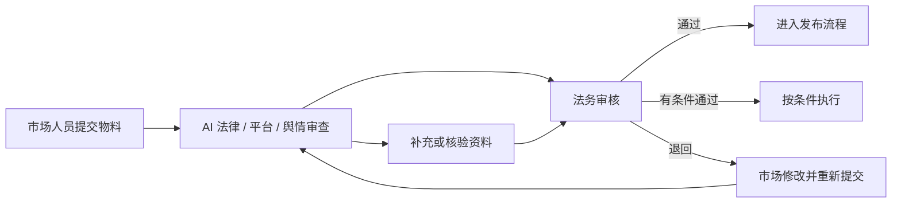

# LexAd v0.7.1 用户指南

本文面向市场、法务和合规人员，说明如何提交广告物料、阅读 AI 审查结果并完成法务闭环。系统判断原则见 [审查方法论](../architecture/review-methodology.md)。

## 1. 角色分工

- 市场人员负责提供完整文案、行业、投放平台和必要证明材料。
- LexAd 负责发布前初筛、资料检索、语境判断和结构化提示。
- 法务人员结合业务事实、证明材料和专业判断作出最终内部决定。
- 管理员负责 AI 配置和资料版本维护。

## 2. 提交物料

进入“提交广告物料”后：

1. 粘贴完整广告文案，或上传文件并预览提取文本；
2. 核对提取内容，特别是 OCR 质量为“一般”或“较低”的文本；
3. 选择至少一个相关行业；
4. 选择至少一个投放平台；
5. 可关联品牌，沉淀品牌历史审查档案；
6. 按需设置物料名称、类型、优先级和截止时间；
7. 点击“开始风险审查”。

支持最大 10 MB 的 JPG、PNG、GIF、BMP、PDF、DOCX、PPTX、XLSX 和 TXT 文件。后端提取文本上限为 50,000 字符；过长文件应拆分或精简。

建议提交完整句子和真实投放上下文。只有标题、关键词或截断句会降低语境判断质量。

品牌可以关联多个标准行业。选择品牌后，品牌常用行业会排在行业列表前方，但系统不会代替提交人自动选择；应按本次物料的真实场景确认行业。物料使用了品牌尚未收录的行业时仍可提交，该行业会进入管理员待确认候选。

## 3. 等待审查

提交后系统创建后台任务，页面自动刷新状态。法律与平台审查、舆情审查分别记录状态；舆情分支不改变法律合规分。

常见状态：

| 状态 | 含义 | 建议动作 |
| --- | --- | --- |
| 等待中 / 分析中 | 后台任务仍在执行 | 等待页面自动刷新 |
| 已完成 | 已形成结构化结果 | 查看风险、核验事项和法务状态 |
| 待人工复核 | 某分域资料或 AI 证据不足 | 交由法务或管理员检查 |
| 失败 | 法律主分支未能完成 | 查看错误信息，修复配置后重新审查 |

如果服务重启导致任务中断，系统会把超时任务标为失败并允许重新提交。

## 4. 阅读法律合规结果

法律合规分为 0–100，分数越高表示当前自动审查发现的明确风险越少。它不是监管机关的合规认证。

### 已确认风险

用户可见风险必须包含：

- 完整原文证据；
- 中文风险等级；
- 结合语境的判断理由；
- 法规、行业资料或平台规则依据；
- 修改建议。

原始关键词、数字切片、分词和内部匹配分不会作为结论展示。如果结果只有孤立词段而没有完整原文和资料依据，应视为异常并反馈管理员。

### 资料核验事项

资料核验事项不是直接违规结论。它表示文案中的销量、数据、检测、认证、资质、来源或证明材料需要外部证据确认。

处理时应：

1. 对照“原文声明”确认核验范围；
2. 查看系统列出的核验原因；
3. 收集报告、授权、证书、统计口径或其他建议材料；
4. 由业务负责人和法务确认材料是否真实、完整、在有效期内。

### 人工复核提示

“待人工复核”表示系统没有足够依据形成可靠自动结论，常见原因包括资料库缺失、生效平台规则不足、AI 不可用或模型引用未通过校验。它不等于低风险，也不等于已经违规。

## 5. 阅读舆情结果

舆情风险独立展示风险等级、风险分、议题、受影响群体、传播诱因、原文证据和建议。风险分越高表示舆情风险越高，与法律合规分方向不同。

本地触发词和案例只用于内部候选召回。页面只展示 AI 结合完整语境确认的原文证据，以及 AI 明确选择且已存在于资料库的相似事件。

舆情风险关注社会观感和传播机制，即使法律层面未发现明确问题，也可能需要调整表达。AI 不可用时，系统不会用本地关键词替代结论，而是提示人工复核。

## 6. 法务决定

法务人员在待审队列中打开任务后，可以提交：

- **通过**：当前材料和投放条件下可以进入后续流程；
- **有条件通过**：必须填写执行条件，例如补充证明、限定渠道或修改局部内容；
- **退回**：填写退回原因，由市场人员修改后重新提交。

法务决定提交后不能直接覆盖，以保护审计记录。需要调整时应按组织流程创建新版本或由管理员依法处理数据。

法务审核台的主中栏同时展示本次提交文案、法律与平台报告以及完整舆情报告。舆情仍在等待或分析时不能提交法务决定；舆情失败或不可用时，法务人员必须先完成并勾选人工舆情复核确认，才能继续决定。

## 7. 修改与版本追溯

已退回物料可以修改并重新审查。系统会：

- 增加物料版本号；
- 保存本次提交时的文案、行业、平台、优先级和截止时间快照；
- 建立新的审查记录；
- 保留历史 AI 结果、法务决定和备注。

工作台列表继续使用首次提交名称作为稳定识别名。打开详情或历史版本后，页面展示该次提交快照中的实际名称与文案；如果重填时没有修改名称，两处名称自然相同。重新提交时原品牌会锁定，不能更换或清空。

结果页的历史版本用于比较提交过程，不应把新资料库结论反向覆盖到旧审查记录。

## 8. 品牌档案

关联品牌后，系统可以汇总品牌相关物料、审查次数、法务决定、平均版本数和近期记录，帮助团队形成可复用的品牌合规记忆。

品牌档案还会展示管理员已确认的多个常用行业。尚未确认的新行业只作为候选，不会自动写入正式品牌行业。

品牌档案顶部的“现有记忆印象”根据历史审核固定归纳整体表现、近期法务倾向、平均修改轮次、高频风险和常见修改建议。少于 3 次法务决定时只显示“样本积累中”，不会形成稳定评价。该记忆与审核界面的品牌参考使用同一数据，但始终只是历史参考，不参与当前物料的 AI 风险评分。

品牌历史只能作为业务参考，不会自动替代当前法规、平台规则或当前文案语境。

## 9. 使用建议

- 在正式发布前提交最终或接近最终的完整文案。
- 行业和平台应按真实投放场景选择，避免为减少提示而漏选。
- 对外部数据、认证和效果声明主动准备证据材料。
- 对高风险、重大预算、敏感群体或争议议题保留人工复核。
- 发现资料过期、引用错误或平台版本缺失时及时反馈管理员。
- 不把“未发现明确风险”表述为“保证合法”。
