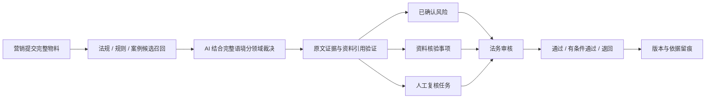

# LexAd：资料库约束下的企业广告合规与舆情协同审查平台

## 项目摘要

LexAd 面向企业广告发布前的合规审查场景，将分散的法律法规、行业资料、平台规则和舆情案例组织为可维护的知识基础，并由 AI 结合完整文案语境完成分领域判断。系统对模型给出的原文证据和资料引用进行二次验证，把输出分为已确认风险、资料核验事项和人工复核任务，帮助营销、法务、合规与平台运营更高效地协作。

项目不试图用关键词代替法律判断，也不把 AI 输出包装成最终法律意见。其创新重点是建立一条资料可追溯、判断可解释、失败可降级、责任可衔接的企业合规辅助流程。

## 一、问题背景

企业广告从创意到发布通常需要跨越营销、法务、合规和多个平台运营环节。传统工作方式存在四类突出问题：

1. **规则分散**：法律、行业规范和平台政策来源不同，版本与有效期也不同。
2. **人工检索成本高**：法务需要反复查找依据、对照文案并整理修改意见。
3. **机械工具误报多**：关键词工具容易把数字、短词和脱离语境的片段直接标为风险。
4. **协作信息断裂**：风险判断、证明材料、修改意见和最终决定缺少统一记录。

广告审查真正困难的部分，不是“有没有出现某个词”，而是该表达在具体行业、投放平台、上下文和证据条件下意味着什么。

## 二、解决方案

LexAd 以企业发布前审查为入口，将流程重构为：

系统同时处理三条风险轴：

- **法律合规**：判断广告表达是否存在法规与行业规则支持的明确风险；
- **平台规则**：按所选平台当前生效版本识别差异化要求；
- **舆情风险**：识别价值观、群体感受、社会伦理和传播机制风险。

三条风险轴分别判断、分别解释。舆情结果不会稀释或放大法律合规分。

## 三、核心创新

### 1. 从“关键词定性”转向“候选召回 + AI 裁决”

本地规则保留高效检索能力，但只负责召回候选。AI 必须阅读完整文案，并结合适用条件判断候选应被确认、排除还是转为资料核验。内部匹配词、数字切片和相似度不会直接成为用户可见理由。

### 2. 资料库优先的约束式判断

AI 优先使用系统提供的法规、行业资料、平台规则和已核验案例。模型只能引用本轮输入中真实存在的资料标识，无法建立可靠依据时不得虚构法规或规则。

这使资料库不只是搜索附件，而是模型判断的边界和结果追溯的基础。

### 3. 原文与依据的双重验证

已确认问题必须同时满足：原文证据能在物料中逐字定位，且引用依据存在于本轮资料输入。系统过滤短数字、单字和无意义片段，并对重复问题去重。

### 4. “风险”与“待证事实”分流

销量、统计数据、检测、认证、资质和来源声明往往需要外部材料，而不能仅凭文案判断真伪。LexAd 将其输出为独立核验事项，说明需要什么材料、为什么需要核验，避免把事实待证直接等同为违法。

### 5. 明确的人工复核降级

AI 不可用、资料缺失、平台没有生效规则或引用校验失败时，系统明确进入人工复核，不把候选规则回退成确定性违规，也不把依据不足包装成自动通过。

## 四、企业实际作用

### 营销部门

- 在创意进入正式发布流程前获得结构化提示；
- 更早了解需要修改的表达和需要准备的证明材料；
- 退回后按版本重新提交，保留修改脉络。

### 法务与合规部门

- 从全面逐字筛查转向重点复核已确认风险、核验事项和异常任务；
- 直接查看原文、判断理由和资料依据，减少重复检索与整理；
- 通过统一输出结构降低不同审查人员之间的尺度差异。

### 平台运营

- 在同一任务中查看不同投放平台的规则要求；
- 使用当前生效规则版本，减少依据过期和跨平台重复查询；
- 将法务决定与具体投放条件联系起来。

### 管理与审计

- 集中维护资料来源、版本、有效期和状态；
- 保存提交快照、规则版本、AI 结果、法务决定与备注；
- 支持后续复盘“当时使用了什么物料和什么依据”。

## 五、效率提升机制

LexAd 的效率价值来自流程重构，而不是未经验证的宣传数字：

- **减少无效复核**：机械命中先由 AI 结合语境过滤，不再把大量候选全部交给法务。
- **缩短检索路径**：风险结论关联资料库标题与版本，降低人工搜索和汇总成本。
- **明确任务分流**：风险判断、事实核验和人工复核分别进入适合的处理路径。
- **支持多平台协同**：一次提交关联多个投放平台及其生效规则版本。
- **沉淀组织知识**：规则变化集中维护在资料库，而不是散落在代码和个人经验中。
- **提高复盘效率**：版本、依据和决定统一留痕，减少跨部门反复确认。

后续量化评测可以采集单条审查耗时、人工复核占比、有效依据完整率、多平台覆盖和核验事项识别情况。没有可复现数据时，项目不提供估算百分比。

## 六、法律与技术可信机制

| 可信问题 | LexAd 的处理方式 |
| --- | --- |
| 规则命中是否等于违规 | 不等于；候选必须经过 AI 语境裁决 |
| AI 是否可以自由编法规 | 不可以；引用必须对应输入资料标识 |
| 证据是否来自原文 | 系统逐字定位并过滤无意义片段 |
| 事实真伪如何处理 | 进入核验事项，要求补充材料 |
| 平台规则是否过期 | 只使用当前生效且在有效期内的版本 |
| AI 失败怎么办 | 标记人工复核，不伪造通过或本地结论 |
| 历史结果能否追溯 | 保存提交快照、资料版本和法务决定 |

工程层面采用结构化模型输出、Pydantic 契约、分域状态、后端权限校验和自动化回归测试。v0.7.2 当前后端测试为 128 项，前端包含 9 项关键交互单元测试，并通过 TypeScript 检查与生产构建。

## 七、应用场景

- 电商详情页、直播话术和短视频脚本的发布前初筛；
- 食品、美妆、医疗、教育、金融等行业的广告表达检查；
- 企业多平台投放时的平台规则差异审查；
- 品牌舆情敏感表达的早期识别；
- 法务退回、修改重提和历史版本复盘；
- 企业内部法规、平台规则和舆情经验的知识化管理。

## 八、社会与法律价值

LexAd 通过技术手段降低中小团队获得结构化合规辅助的门槛，让广告审查从“事后发现问题”更早移动到“发布前识别和协作处理”。

同时，项目坚持三项边界：

1. AI 不能取代专业法律判断；
2. 资料可追溯比模型口头解释更重要；
3. 不确定性应被显式呈现，而不是被隐藏为确定答案。

这种人机协同方式既提高企业工作效率，也有助于减少误导性传播、平台违规和不当营销表达。

## 九、当前边界与演进方向

当前版本仍依赖资料维护质量和外部模型可用性，文案之外的事实与授权关系需要人工核验。进程内后台任务适合产品演示和中小规模使用，不等同于高并发生产队列。

后续可继续完善：

- 法规与平台规则的更新提醒和覆盖度评估；
- 面向企业真实流程的量化效率评测；
- 更细粒度的行业知识和地域规则；
- 持久化任务队列与多实例部署；
- 人工复核反馈驱动的资料质量改进。

## 延伸阅读

- [演示与评测指南](demo-evaluation-guide.md)
- [审查方法论](../architecture/review-methodology.md)
- [技术参考](../architecture/technical-reference.md)
- [v0.7.0 发布说明](../archive/releases/v0.7.0-release-notes.md)
